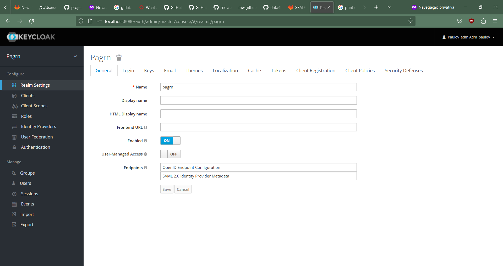
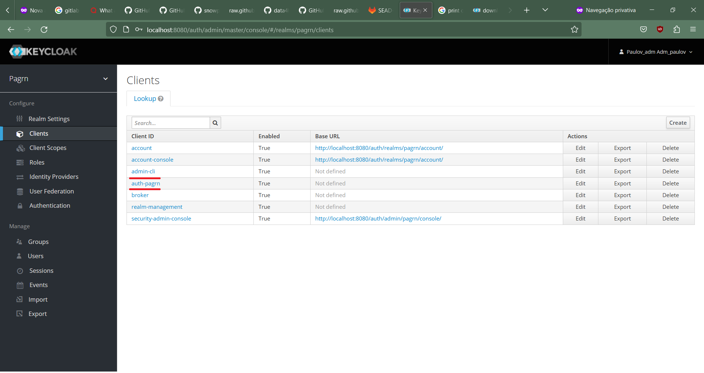
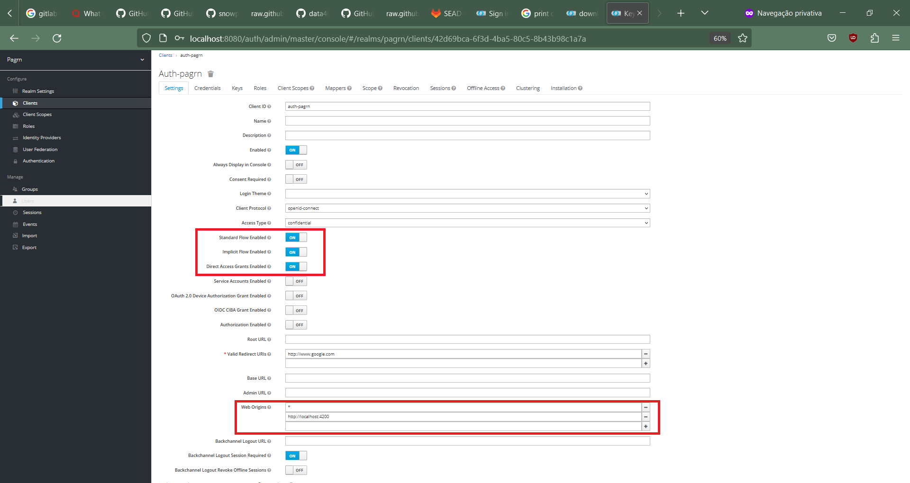
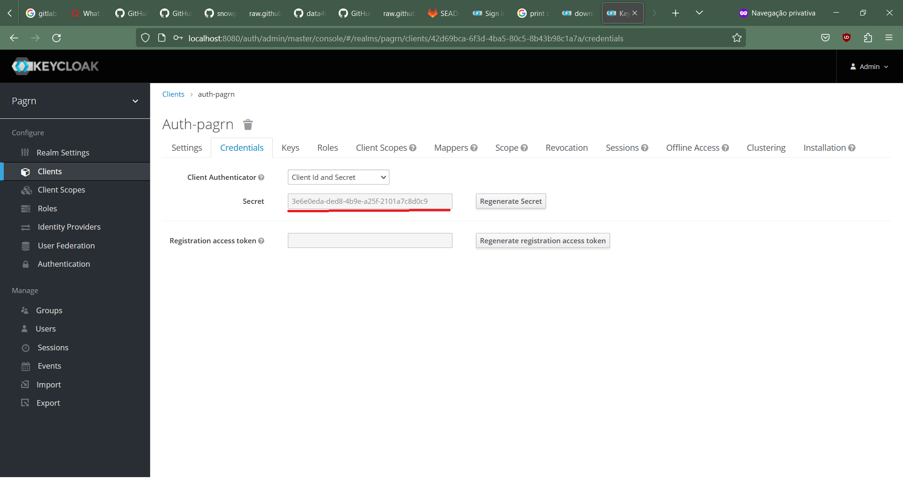
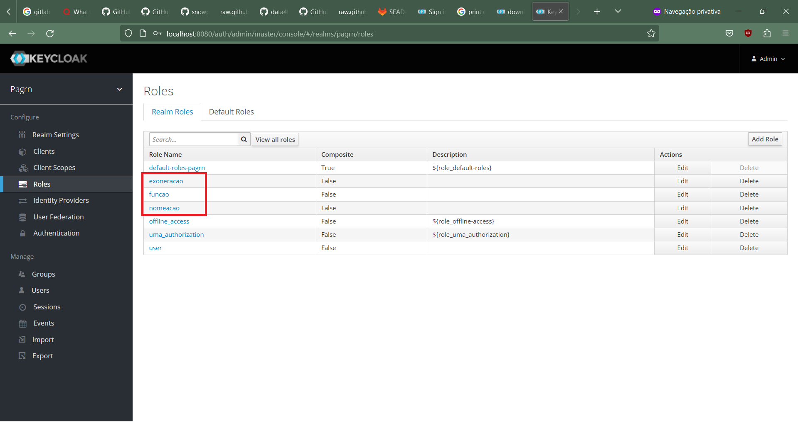
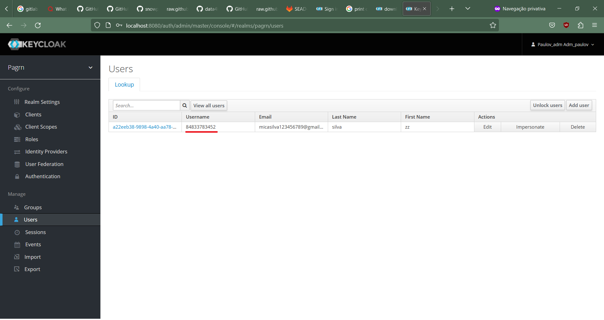
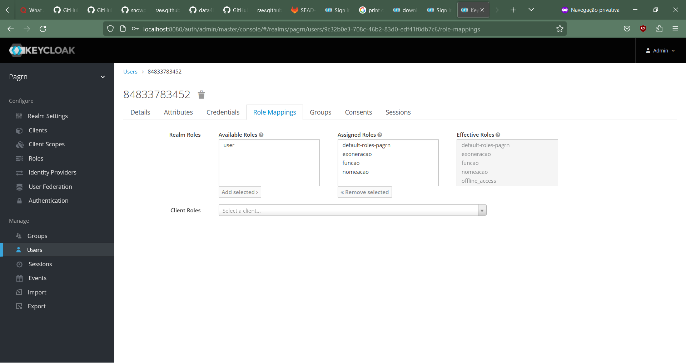
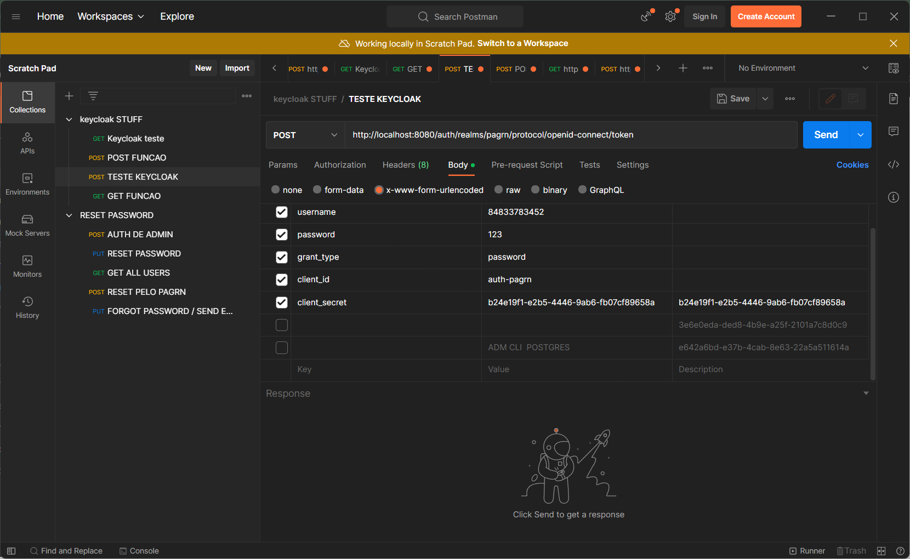
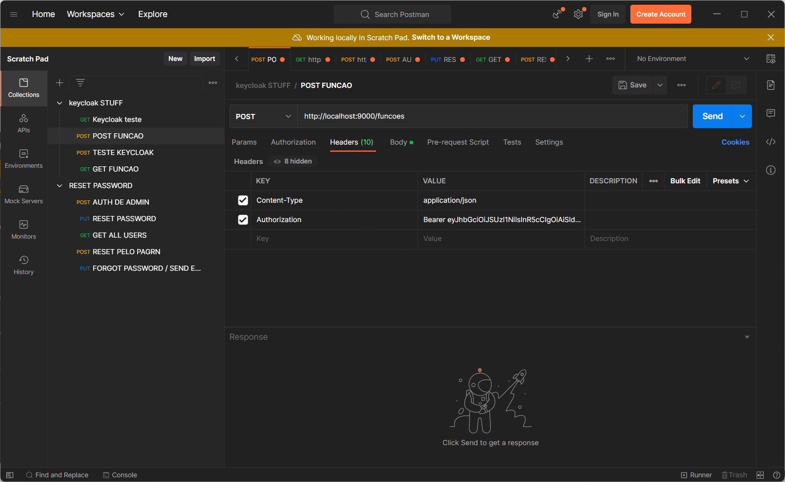

# Segurança Backend PagRN

## Contribuidores

Nome                     | RA    
-------------------------| ------
PV |20222001137 
Pedro             |20222000120  

O pagrn utiliza o sistema do keycloak para autenticação e autorização no sistema, o keycloak gerencia usuários, papéis e permissões em um banco postgres separado do banco do pagrn.

Este documento teve como base no keycloak 15.0.02

# Configuração do ambiente

É necessário a instalação do keycloak por meio do site 
https://www.keycloak.org/downloads , após a instalação, o dev deverá ir até a pasta BIN do keycloak e rodar o `standalone.bat` ou `standalone.sh` dependendo do OS e por padrão ele tentará rodar na porta 8080.

Por padrão o keycloak roda em um banco h2, para alterar para o postgres é necessário algumas etapas extras.

o jar do postgres pode ser instalado por meio do site
https://jdbc.postgresql.org/download/

Crie ou altere caso já exista os arquivos na seguinte pasta
\modules\system\layers\keycloak\org\postgresql\main

Deverá ter 2 arquivos:
module.xml
{postgresql-SUA-VERSAO}.jar

Com o .jar do postgres colocado nesta pasta, altere o `module.xml` para ter os seguintes valores

```
<?xml version="1.0" ?>
<module xmlns="urn:jboss:module:1.3" name="org.postgresql">

    <resources>
        <resource-root path="postgresql-{SUA-VERSAO}.jar"/>
    </resources>

    <dependencies>
        <module name="javax.api"/>
        <module name="javax.transaction.api"/>
    </dependencies>
</module>
```
Após isso, na pasta \standalone\configuration altere o arquivo `standalone.xml`

<b>SUBSTITUA</b> o datasource KeycloakDS pelo seguinte

```
<datasource jndi-name="java:jboss/datasources/KeycloakDS"           pool-name="KeycloakDS" enabled="true" use-java-context="true">
    <connection-url>jdbc:postgresql://localhost/keycloak</connection-url>
    <driver>postgresql</driver>
    <pool>
        <max-pool-size>20</max-pool-size>
    </pool>
    <security>
        <user-name>{NOME DO SEU USER DO BANCO}</user-name>
        <password>{NOME DA SUA SENHA NO BANCO}</password>
    </security>
</datasource>
```

e adicione abaixo nos drivers a seguinte parte

```
<driver name="postgresql" module="org.postgresql"> 
    <xa-datasource-class>org.postgresql.xa.PGXADataSource</xa-datasource-class>
</driver> 
```

Desta forma o keycloak rodará em um banco postgres

#### <b><i>obs: esta configuração só é válida para o keycloak rodando local, se for por meio de um container docker o procedimento de configuração é diferente</i></b>


# Como funciona o keycloak?




No canto superior esquerdo é possível ver "Pagrn" escrito abaixo do logo do keycloak, este realm foi criado manualmente, para evitar o uso do default do keycloak que é o "master".



Acessando a parte de clients, temos 2 clientes relevantes, o `auth-pagrn` que foi criado por nós, e o `admin-cli`, o auth-pagrn nós utilizamos para requisições autenticadas sobre os usuários/sistema, enquanto o admin-cli é utilizado para ações que envolvam alteração dos usuários do keycloak



Ao acessar nosso cliente do keycloak ( auth-pagrn ) é necessário configurar estas informações, na parte de web origins fica à disposição de quais origens ele vai permitir para não causar problemas de CORS

#### <b><i>obs: no cliente do admin-cli é necessário marcar o Service Accounts Enable </b></i>



Na parte de credenciais do cliente, há a chave secreta que é necessária para fazer a requisição inicial com informações do usuário para pegar o token de acesso, fica o adendo que existem 1 chave para cada client, portanto a chave do admin-cli é diferente da chave do cliente auth-pagrn



Na parte de roles é possível ver as roles que irão ser consumidas pelo pagrn, a ideia proposta é que haverão roles para cada evento ou funcionalidade que requerir permissões especiais, fazendo assim o controle de autorização



Na listagem de usuários é possível ver os usuários listados no banco de dados do keycloak, é importante que o username de cada usuário seja respectivo ao cpf do usuário cadastrado no backend do pagrn para permitir a troca de informação entre o frontend e o backend



Em role mappings é possível decidir quais as roles que vão ser associadas ao usuário

# Login



O login no keycloak deve ser feito por meio de um POST para a URL:
http://localhost:8080/auth/realms/pagrn/protocol/openid-connect/token 


usando o body com x-www-form-urlencoded
```shell
{
    "username":<cpf do usuario logando>,
    "password":"<senha do usuario>",
    "grant_type":"password",
    "client_id":"<auth-pagrn OU admin-cli>",
    "client_secret":"<client secret do keycloak>"
}
```
#### <b><i>obs: login usando o admin-cli só necessita grant_type, client_id e client_secret </i></b>
<br>
<b>O login também pode ser diretamente feito pro nosso servidor no endpoint auth/login passando apenas username e senha, de forma mais simplificada e ignorando algumas informações que não são utilizadas.</b>

<br>
Após feito esse processo (diretamente pelo keycloak), será devolvido um json com algumas informações

```shell
{
    "access_token",
    "expires_in",
    "refresh_expires_in",
    "refresh_token",
    "token_type",
    "not-before-policy",
    "session_state",
    "scope"
}
```
* o access_token é a informação principal que precisamos da resposta do login, através dele iremos ter permissão para fazermos requisições ao pagrn
* expires_in é o tempo no qual a sessão do token de acesso do usuário expirará
* refresh_expires_in é o tempo no qual o refresh token expirará
* refresh_token é utilizado para pegar um novo token de acesso após um ter expirado
* token_type é "Bearer"
* Outras informações são irrelevantes para o sistema


# Requests autenticados



Após de ter sido feito um login bem sucedido os requests para endpoints do pagrn deverão conter no cabeçalho a key: Authorization com o value: `Bearer    <SEU TOKEN DE AUTENTICAÇÃO>`

## Outros requests importantes -- admin-cli

#### Todos usuários no keycloak:
GET: 
http://localhost:8080/auth/admin/realms/pagrn/users/

#### versão pelo pagrn
`TODO !!!!`

#### Reset de senha de um user keycloak:
PUT:
http://localhost:8080/auth/admin/realms/pagrn/users/ID-USUARIO-NO-KEYCLOAK/reset-password

body:
```
{
    "type":"password",
    "value":"<sua nova senha>",
    "temporary":false
}
```
#### versão pelo pagrn
/reset/{username}


#### Esqueci minha senha keycloak:
PUT:
http://localhost:8080/auth/admin/realms/pagrn/users/ID-USUARIO-NO-KEYCLOAK/execute-actions-email

body:
```
["UPDATE_PASSWORD"]
```

#### versão pelo pagrn
`TODO !!!!`

#### <i><b>obs: para rodar a funcionalidade de esqueci minha senha é necessário configurar o email em realm management</i></b>

C'est ça


### [Home](home)

<ul> 
    <li>Segurança
        <ul>
            <li>Configuração do keycloak
                <ul>
                    <li>[Configuação via arquivo](keycloak_file_config)</li>
                    <li>Configuração via docker</li>
                </ul>
            </li>
            <li>[Utilização do keycloak](keycloak_usage)</li>
            <li>[Requisições](requests)</li>
            <li>Aspectos</li>
        </ul>
    </li>
</ul>

<hr>

- [Sidebar](_sidebar)